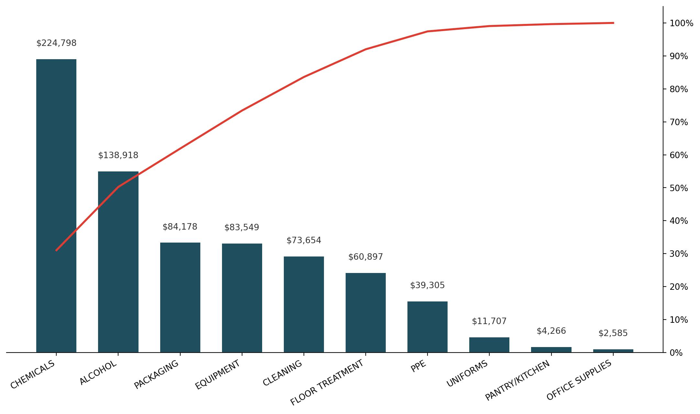
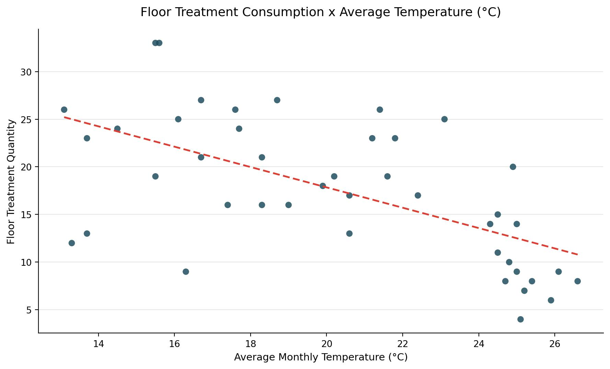
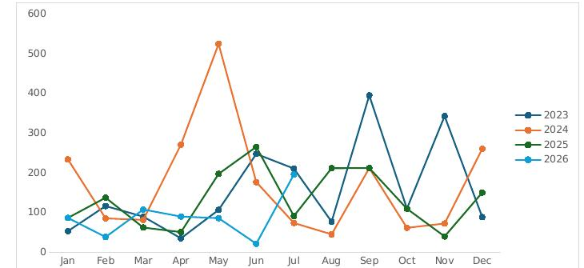

# Clima e Consumo de Suprimentos — Análise de Dados em Gestão de Facilities

Análise de dados aplicada ao setor de facilities management, cruzando dados meteorológicos horários (INMET) com o histórico de pedidos de material de uma empresa que atua na região metropolitana de Porto Alegre-RS, Brasil.

📄 **Leia a análise completa no Medium:** https://medium.com/@vitor.grc89/como-o-clima-influencia-o-consumo-de-suprimentos-uma-an%C3%A1lise-de-dados-aplicada-%C3%A0-gest%C3%A3o-de-641b00a30ffb | https://medium.com/@vitor.grc89/how-weather-shapes-supply-consumption-a-data-driven-case-study-in-facilities-management-b0f786a94b32

## Contexto do negócio

A empresa gerencia múltiplos contratos de facilities, cada um com pedidos de material feitos de forma independente pelos supervisores operacionais — sem uma visão consolidada de quais itens pesam mais no orçamento, nem de quais fatores externos poderiam estar influenciando esse consumo.

Duas perguntas guiaram o projeto:
1. Quais produtos representam os maiores custos de suprimentos?
2. O quanto o clima influencia esse consumo?

## Dados

- **Meteorológicos**: INMET, estação automática Porto Alegre – Jardim Botânico (A801), granularidade horária, jan/2023 a jul/2026
- **Pedidos de material**: mensais, região metropolitana de Porto Alegre-RS, mesmo período

## Metodologia

O projeto seguiu a estrutura **CRISP-DM** (Business Understanding → Data Understanding → Data Preparation → Modeling → Evaluation):

- **Data Preparation**: tratamento de valores ausentes (656 registros meteorológicos removidos por falha de estação), padronização de formatos, criação de variáveis derivadas — colunas binárias sinalizando horas do ano dentro da faixa de temperatura recomendada (18–25°C) para produtos de tratamento de piso, conforme especificação do fabricante
- **Modeling**: análise exploratória de sazonalidade, curva de Pareto para priorização de categorias por custo, correlação de Pearson entre variáveis climáticas e consumo mensal por categoria
- **Evaluation**: tradução dos achados estatísticos em recomendações de negócio acionáveis

## Principais achados

- **Concentração de custo**: 3 categorias (químicos, álcool e sacarias) respondem por 62% do custo total de suprimentos no período

  
  
- **Tratamento de piso × temperatura**: correlação de Pearson de -0,60 — consistente com a janela de temperatura recomendada pelo fabricante do produto

  

- **Evento climático extremo**: as enchentes de maio de 2024 no Rio Grande do Sul (o mês mais chuvoso já registrado na estação de referência de Porto Alegre desde 1910) coincidem com um pico relevante no consumo de EPI — evidência de que eventos extremos, não a variação sazonal comum, são o que mais move o consumo

  

## Estrutura do repositório

```
Gestao-de-facilities/
├── README.md
├── scripts/                       # o script de tratamento de dados
│           
├── dados/
│   ├── raw/                       # arquivos como vieram do INMET, sem tratamento
│   │    
│   └── processed/                 # já limpos pelo script, prontos pra análise  
│       
├── planilhas/                     # análises com fórmulas/gráficos nativos
|                 
└── imagens/                       # gráficos exportados
```

## Limitações

- Escopo restrito à região metropolitana de Porto Alegre — o comportamento climático (e sua relação com o consumo) varia entre as demais regiões atendidas pela empresa
- Preços utilizados na curva de Pareto de custo são estimativas de mercado, não cotações formais
- Correlações brutas podem estar parcialmente infladas por sazonalidade compartilhada entre as séries climática e de consumo

## Próximos passos

- Migração da base para SQL/BigQuery
- Dashboard em Power BI para acompanhamento contínuo
- Extensão da análise para as demais regiões atendidas pela empresa

---

*Projeto desenvolvido como parte de [Análise estatística da influência do clima no consumo de insumos na gestão de facilities/portfólio de transição de carreira para dados]. Dúvidas ou sugestões, fique à vontade para abrir uma issue ou entrar em contato.*
